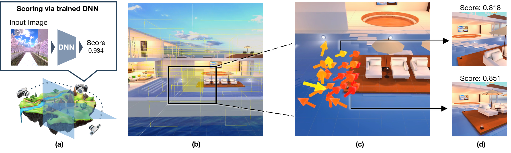
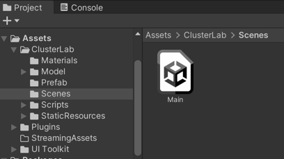
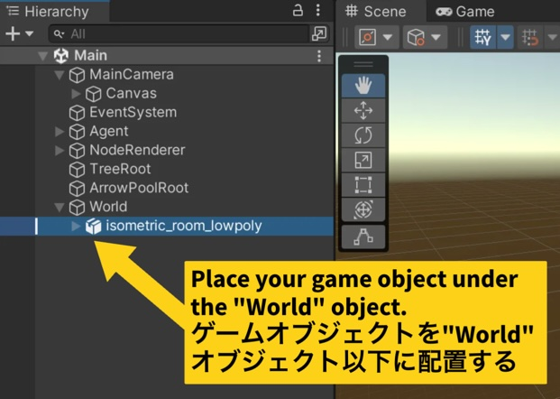
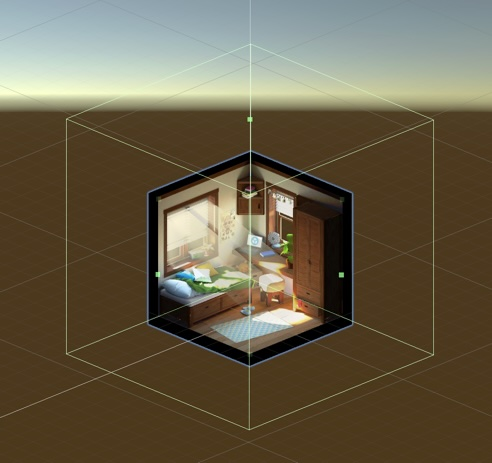
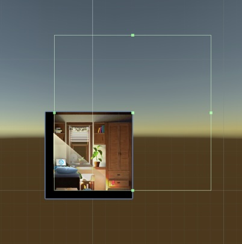
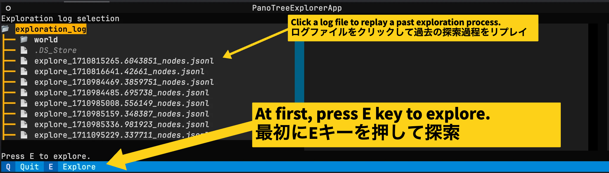
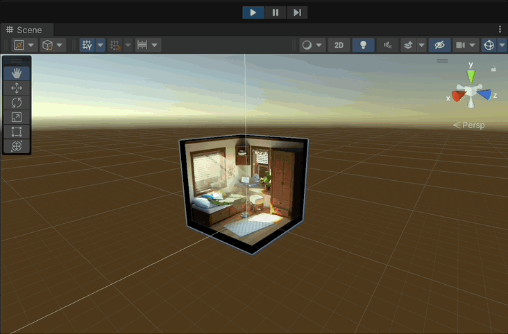
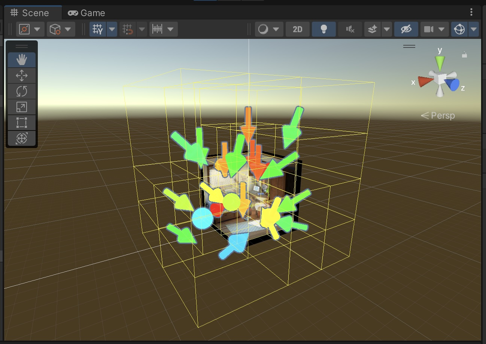
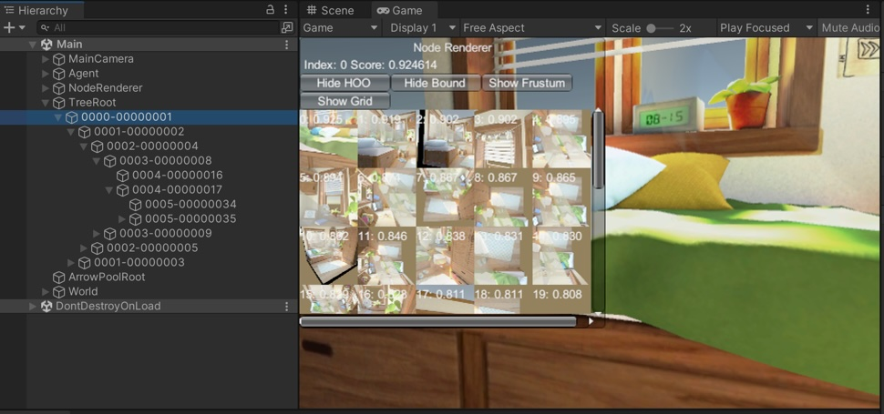

# PanoTree: Automated Photospot Explorer in Virtual Reality Scenes


[](./LICENSE)

This is the code for PanoTree: Automated Photospot Explorer in Virtual Reality Scenes

* [Project Page](https://cluster-lab.github.io/panotree)
* [Paper](https://lab.cluster.mu/)
* [Video](https://lab.cluster.mu/)


## Prerequisites

* Windows 11 23H2 or later (also works on WSL2), Ubuntu 20.04 or later, macOS 14.5 or later 
* python 3.10.13
* Unity 2021.3.2f1

## Setup

1. Install Unity 2021.3.2f1 with Windows Build Support
2. Install Python 3.10.13
3. Install the required packages using poetry

```bash
poetry install
```

## Prepare the scene

Before exploring the photospots, you need to prepare the VR scenes by following procedure:

1. Open the Unity project inside `unityproject/`.
2. Open the `Assets/ClusterLab/Scenes/Main` scene.
   
3. Place the game objects under the "World" object.
   
4. Create Collider objects to define exploration space.
     
     
   __Note that the collider objects defines the space that the camera can move. If the space too small, the camera may
   not be able to capture any meaningful images.__

```
Note that the example scene is just for demonstration purposes.
This algorithm meant to be applied to more complex and larger scenes.
```

## Explore

After preparing the environment, you can explore the photospots in the VR scenes by following procedure:

1. Prepare the scene as described above.
2. Start the API server  
   Start the server by clicking the `Play` button on the Unity Editor.
3. Start the PanoTree explorer
    ```bash
    poetry shell
    python panotree_explorer.py --device cuda --api_host localhost
    ```
   __If you're running panotree_explorer.py on WSL, you need to specify the IP address of the host machine instead
   of `localhost`.__
4. Press E to explore the photospots.
   
5. Switch to the Unity Editor and open the scene view to see the exploration process.  
   Note: Keep the game view visible at the same time for the rendering process to work properly.
   

## Node Visualization

### Scene view

* The arrows represent the best camera directions in the node.  
    * The Color of the arrows the score of the node.
        * Red: High score
        * Green: Intermediate score
        * Blue: Low score
    * Note that the Arrows in the teaser image are the results of the grid search in the leaf nodes and are not
      displayed in the actual implementation.
    
### Game view

* Under the "TreeRoot" object, there are "Node" objects that represent the nodes in the exploration tree.
* `Node Renderer` window shows the rendering results corresponding the camera directions and the score of the node, including descendants' ones.
    * `Show/Hide HOO` toggle button shows/hides the arrows of HOO nodes.
    * `Show/Hide Bound` toggle button shows/hides the bounding box of the node.
    * `Show/Hide Frustum` toggle button shows/hides the frustum of the camera.


## Command Line Usage

In most cases, it is sufficient to specify only the torch device, for example `--device cpu`.

```bash
usage: panotree_explorer.py [-h] [--num_updates NUM_UPDATES] [--num_local_dir NUM_LOCAL_DIR] [--c C] [--v1 V1] [--rho RHO] [--seed SEED] [--policy_name POLICY_NAME]
                            [--value_strategy VALUE_STRATEGY] [--log_root LOG_ROOT] [--api_host API_HOST] [--api_port API_PORT] [--lower_size_bound LOWER_SIZE_BOUND]
                            [--score_threshold SCORE_THRESHOLD] [--model NAME] [--in-chans N] [--input-size N N N N N N N N N] [--num-classes NUM_CLASSES]
                            [--class-map FILENAME] [--gp POOL] [--log-freq N] [--checkpoint PATH] [--pretrained] [--num-gpu NUM_GPU] [--test-pool] [--no-prefetcher]
                            [--pin-mem] [--channels-last] [--device DEVICE] [--amp] [--amp-dtype AMP_DTYPE] [--amp-impl AMP_IMPL] [--tf-preprocessing] [--use-ema]
                            [--fuser FUSER] [--fast-norm] [--model-kwargs [MODEL_KWARGS ...]] [--torchscript | --torchcompile [TORCHCOMPILE] | --aot-autograd]

options:
  -h, --help            show this help message and exit
  --torchscript         torch.jit.script the full model (default: False)
  --torchcompile [TORCHCOMPILE]
                        Enable compilation w/ specified backend (default: inductor). (default: None)
  --aot-autograd        Enable AOT Autograd support. (default: False)

Hierarchical Optimistic Optimization (HOO) Parameters:
  --num_updates NUM_UPDATES
                        maximum number of nodes to be explored (default: 300)
  --num_local_dir NUM_LOCAL_DIR
                        number of camera directions to be sampled each nodes (default: 21)
  --c C                 HOO hyperparameter c(exploration term), must be greater than 0. (default: 0.2)
  --v1 V1               HOO hyperparameter v1(regularization term), must be greater than 0. (default: 0.5)
  --rho RHO             HOO hyperparameter rho(regularization term), must be greater than 0. (default: 0.5)
  --seed SEED           random seed for HOO (default: 42)
  --policy_name POLICY_NAME
                        policy name (determines strategy to split the space) (default: size)
  --value_strategy VALUE_STRATEGY
                        how to compute value for HOO (max or mean) (default: max)
  --log_root LOG_ROOT   root directory for logs (default: ./output/exploration_log)

Render API Parameters:
  --api_host API_HOST   host for render server (default: None)
  --api_port API_PORT   port for render server (default: 8080)

Leaf Grid Search Parameters:
  --lower_size_bound LOWER_SIZE_BOUND
                        lower size bound in meters, used to prune nodes with small size (default: 2.5)
  --score_threshold SCORE_THRESHOLD
                        lower score threshold (default: 0.3)

Scoring Net Parameters:
  --model NAME, -m NAME
                        model architecture (default: dpn92) (default: vit_base_patch16_224.augreg2_in21k_ft_in1k)
  --in-chans N          Image input channels (default: None => 3) (default: None)
  --input-size N N N N N N N N N
                        Input all image dimensions (d h w, e.g. --input-size 3 224 224), uses model default if empty (default: None)
  --num-classes NUM_CLASSES
                        Number classes in dataset (default: 2)
  --class-map FILENAME  path to class to idx mapping file (default: "") (default: )
  --gp POOL             Global pool type, one of (fast, avg, max, avgmax, avgmaxc). Model default if None. (default: None)
  --log-freq N          batch logging frequency (default: 10) (default: 10)
  --checkpoint PATH     path to latest checkpoint (default: none) (default: ../model_best.pth.tar)
  --pretrained          use pre-trained model (default: False)
  --num-gpu NUM_GPU     Number of GPUS to use (default: 1)
  --test-pool           enable test time pool (default: False)
  --no-prefetcher       disable fast prefetcher (default: False)
  --pin-mem             Pin CPU memory in DataLoader for more efficient (sometimes) transfer to GPU. (default: False)
  --channels-last       Use channels_last memory layout (default: False)
  --device DEVICE       Device (accelerator) to use. (default: cuda)
  --amp                 use NVIDIA Apex AMP or Native AMP for mixed precision training (default: False)
  --amp-dtype AMP_DTYPE
                        lower precision AMP dtype (default: float16) (default: float16)
  --amp-impl AMP_IMPL   AMP impl to use, "native" or "apex" (default: native) (default: native)
  --tf-preprocessing    Use Tensorflow preprocessing pipeline (require CPU TF installed (default: False)
  --use-ema             use ema version of weights if present (default: False)
  --fuser FUSER         Select jit fuser. One of ('', 'te', 'old', 'nvfuser') (default: )
  --fast-norm           enable experimental fast-norm (default: False)
  --model-kwargs [MODEL_KWARGS ...]
```

## Citing

If you find our work useful, please consider citing:

```BibTeX
@misc{hayase2024panotree,
      title={PanoTree: Autonomous Photo-Spot Explorer in Virtual Reality Scenes},
      author={Tomohiro Hayase and Braun Sacha and Hikari Yanagawa and Itsuki Orito and Yuichi Hiroi},
      year={2024},
      eprint={2405.17136},
      archivePrefix={arXiv},
      primaryClass={cs.CV}
}
```
